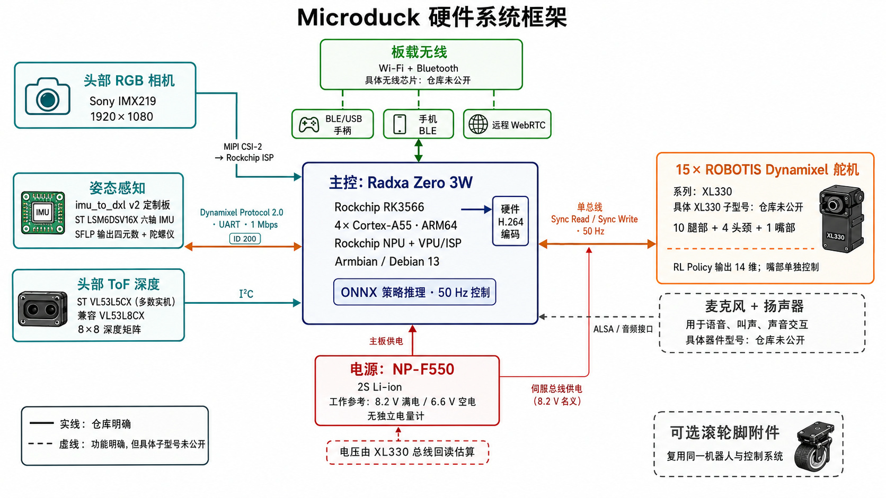
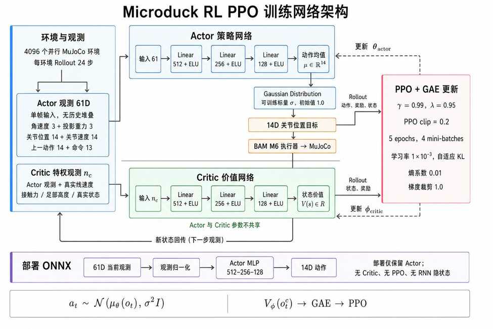

## 一句话看懂 MicroDuck
MicroDuck 是 Pollen Robotics 开源的一台小型双足机器人：约 **25 cm、800 g**，主控采用 Rockchip RK3566，整机拥有 15 个舵机，核心运动策略以 **50 Hz** 运行。它真正值得拆解的地方，不只是“小”，而是把硬件、实时控制、机器人服务、强化学习训练和策略发布做成了一条相对完整的工程链路。

从信息流看，它可以压缩成一行：

**遥控与技能命令 → JSON-RPC → robotd 50 Hz 控制环 → 61 维观测 → ONNX 策略 → 14 维动作 → Dynamixel 总线 → 机器人 → 传感器反馈**

这篇文章不是复述 README，而是沿着这条链路解释：数据在哪里产生，决策在哪里发生，安全边界在哪里，以及仿真策略如何最终落到真实电机上。

## 01 · 硬件：小体积里的完整机器人系统

> 图 1 · 我们此前整理的 MicroDuck 硬件架构。策略直接控制 14 个运动关节；第 15 个舵机用于下颌等非步态动作。

硬件可以分成五层：

- **计算**：Radxa Zero 3W 一类 RK3566 平台承担 Linux、推理与系统服务。
- **执行**：Dynamixel XL330 形成主要关节网络。10 个腿部关节负责双足运动，4 个头颈关节进入统一策略动作，另有 1 个下颌舵机。
- **姿态与接触线索**：IMU 提供机体方向、角速度和加速度，是步态策略最重要的本体感知来源之一。
- **环境感知**：RGB 相机与 ToF 深度传感器为远程观察、交互和后续感知任务预留入口。
- **能源与交互**：2S 电池、麦克风和扬声器让它不只是一个“会走的腿架”。

关键点是：MicroDuck 没有把学习控制做成一个与整机割裂的 demo。电池电压、舵机动力学、通信延迟和传感器误差，都会继续进入后面的 Sim2Real 设计。

## 02 · 系统软件：用服务边界隔离复杂度

> 图 2 · 从输入客户端、JSON-RPC、系统服务到 50 Hz 策略控制链。

官方仓库是一个 Rust workspace。各个进程职责明确：

- `robotd` 持有电机总线和实时控制环，是运动系统的唯一核心所有者。
- `padd` 处理手柄输入，`btd` 处理蓝牙，`mediad` 提供 WebRTC 媒体能力。
- `configd` 管理网络和机器人身份，`updaterd` 负责签名更新与回滚。
- `tofd` 管理深度数据，其它客户端通过统一 JSON-RPC 契约经 Unix Socket 协作。

这种拆分很重要：上层 App、手柄或技能系统不直接碰电机，而是发送“意图”；只有 `robotd` 把意图变成关节动作。于是控制实时性、硬件所有权和产品功能不会纠缠在同一个进程里。

## 03 · 实机控制：策略只是环路中的一段

> 图 3 · ONNX 推理、关节控制、安全门与行为状态机共同组成实机运行时。

每 20 ms 左右，控制环完成一次闭环：

- 读取关节位置、速度与 IMU 状态。
- 拼出统一的 **61 维观测**：48 维本体状态，加上速度、头部姿态和身体姿态等命令。
- 执行观测归一化并调用 ONNX Runtime。
- 策略输出 **14 维动作**，再经过缩放、限幅和安全检查。
- 通过 Dynamixel Sync Write 下发目标，并读取下一帧反馈。

这里有一个常被忽略的事实：**神经网络并不等于控制系统**。真正能上实机，还需要健康状态门控、掉包处理、摔倒预测、失效时的 coast/limp 策略，以及技能切换的状态机。MicroDuck 让站立、行走、起身、坐下、踢球、翻滚等策略可以在同一观测/动作契约后热切换，而不是每个技能重写一套机器人接口。

## 04 · 强化学习：Actor 部署，Critic 留在训练场

> 图 4 · 我们此前依据 MicroDuck RL 代码链路整理的 PPO 训练结构。

训练侧使用 MuJoCo/MJLab 风格的并行环境与 PPO。Actor 接收部署时真实机器人能得到的观测，输出 14 个关节动作；Critic 则可以读取仿真中的特权信息，帮助价值估计，但不会被带到实机。

这形成一个清晰的工程约束：

- **Actor 的输入必须可部署**，不能偷偷依赖仿真真值。
- **Critic 可以更聪明**，用质量、接触、地形等特权状态降低训练难度。
- 导出 ONNX 时把观测归一化一并固化，减少 Python 训练端与 Rust 运行端之间的数值偏差。
- manifest 明确 `obs_len: 61`、`action_len: 14` 和 `control_hz: 50`，让模型文件成为可校验的接口，而不是一个来历不明的黑盒。

## 05 · Sim2Real：先让执行器像真的，再随机化世界

> 图 5 · 名义动力学、BAM 执行器模型与保守域随机化共同构成 Sim2Real 核心。

MicroDuck RL 使用面向 XL330 的 BAM M6 执行器模型。它不是简单的“目标角度乘一个 PD”，而是显式描述电压控制、反电动势以及 Coulomb、Stribeck 和负载相关摩擦。动作链因此变成：

**关节目标 → 延迟缓冲 → BAM 电机模型 → 关节力矩 → MuJoCo 刚体动力学**

在这个名义模型上，再加入有限而有物理含义的随机化：

- 电池电压约在 **6.5–8.2 V** 范围变化，并模拟压降。
- 控制/通信延迟在若干帧之间变化。
- 关节摩擦、惯量、机体质量、质心和接触参数扰动。
- 观测噪声与周期性外力扰动。
- 训练开始、环境 reset 与运行过程采用不同时间尺度的随机化。

这里的思路不是“随机得越多越鲁棒”，而是 **先建立可信的名义机器人，再覆盖真实硬件可能出现的误差带**。随机化太宽会让策略保守、动作发软；太窄则会在某块电池、某个地面或某批舵机上失效。

## 06 · 从训练产物到可运行技能
模型训练完成后，链路还没有结束。一个可部署策略至少需要：

- 导出带归一化的 ONNX Actor。
- 用 manifest 声明观测、动作、控制频率和策略类型。
- 发布到可追踪的模型仓库或 release。
- 由机器人侧下载、校验并加载。
- 通过统一命令编码接入行为 FSM。
- 在实机安全门之后运行，并保留回滚路径。

这也是 MicroDuck 最有参考价值的部分：它把“训练出一个会走的策略”扩展成“交付一个机器人可以安全加载、切换和升级的技能”。

## 07 · 对自己的机器人项目有什么启发
如果把这套结构迁移到四足、人形或机械臂项目，我会保留四个原则：

- **硬件总线只有一个所有者**：避免多个节点争抢控制权。
- **固定策略契约**：观测维度、动作维度、频率、归一化和关节顺序全部写进 manifest。
- **模型与安全解耦**：策略可以迭代，限幅、健康检查和失效处理必须长期稳定。
- **Sim2Real 从执行器开始**：先解释电机为何产生这个力矩，再讨论大规模域随机化。

MicroDuck 体积很小，但它展示的是一条完整的具身工程闭环：机械结构提供动作空间，系统软件保证边界，强化学习生成行为，部署层把行为变成可靠的产品能力。

## 参考与版本说明
本文结构图来自我们此前对 MicroDuck 代码链路的整理，正文以 2026-09-07 可见的官方仓库为参考。项目仍在快速更新，具体 BOM、策略和参数请以源代码为准。

- [Pollen Robotics / microduck](https://github.com/pollen-robotics/microduck)
- [Pollen Robotics / microduck_rl](https://github.com/pollen-robotics/microduck_rl)
- [系统架构说明](https://github.com/pollen-robotics/microduck/blob/main/docs/design/architecture.md)
- [策略 Manifest 规范](https://github.com/pollen-robotics/microduck/blob/main/docs/policy-manifest.md)
